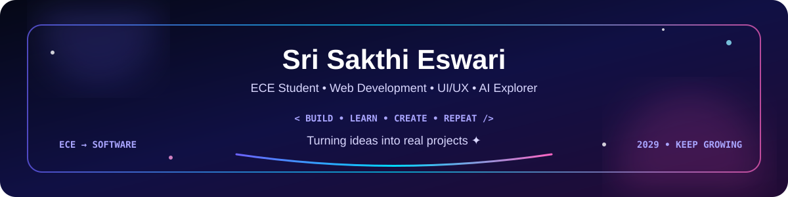

 

 

---

## 🌷 About Me

Hi! I'm **Sri Sakthi Eswari**, an **Electronics & Communication Engineering (ECE) student** graduating in **2029**. I'm exploring the world of software development, especially **web development, UI/UX and AI**.

- 💻 Building practical projects while strengthening my fundamentals
- 🎨 Enjoying **UI/UX design** and clean, user-friendly interfaces
- 🤖 Exploring **Artificial Intelligence & Generative AI**
- 🌱 Learning by experimenting instead of only studying theory
- 🚀 Slowly turning ideas into real applications
- 💡 Interested in both the **technical and creative** sides of product building

---

## 🛠️ Tech Stack

### 👩‍💻 Programming

### 🌐 Web Development

### 🎨 Design & Developer Tools

> 🌱 **Note:** I'm still learning several of these technologies, so I prefer to show them as skills I'm exploring rather than claiming expert-level knowledge.

---

## 🚀 Featured Projects

### 🛍️ E-Commerce Platform

A team-based e-commerce application where my current contribution focuses on the **Quotation and Invoice modules**, along with frontend/UI work.

**Focus:** React • UI/UX • Frontend Development • Git & GitHub

---

### 🎓 Univio — Student & Education Platform

An education-focused platform concept designed to bring **students, institutions and opportunities** together. The idea includes career guidance, college information, seminars, webinars, symposiums, hackathons and competitive-exam resources.

**Focus:** Product Idea • Web Platform • UI/UX • Education Technology

---

### 🧠 Mind Journal

A Python/Tkinter application for recording moods, tracking stress levels, saving journal entries and visualizing progress.

🏆 **2nd Prize — Kalantra Fest 2K26**

**Built with:** Python • Tkinter

---

---

## 🌱 Currently Learning

`JavaScript` • `React` • `Node.js` • `TypeScript` • `Next.js` • `UI/UX` • `Generative AI` • `Git & GitHub`

---

## 🎯 Goals

- 💼 Become a strong **software engineer**
- 🧩 Build more real-world projects
- 🎨 Improve my **UI/UX + frontend** skills
- 🤖 Build useful applications with **AI**
- 🌍 Create technology that solves meaningful problems
- 🚀 Gain industry experience through internships and projects
- 🏗️ One day, build and lead my own technology company

---

## 🏆 Experience & Achievements

- 🥈 **2nd Prize — Kalantra Fest 2K26** for Mind Journal
- 🎤 **Organizer Appreciation Certificate — GREENVERSE Hackathon, MTC**
- 🛍️ **Web Development Team Member — MTC E-Commerce Project**
- 🎓 **Univio — Education platform concept submitted for MSME Hackathon**
- 🤖 Participated actively in a **Generative AI & Prompt Engineering workshop**

---

## 📊 GitHub Journey

  

---

## 📈 Contribution Graph

---

## 💡 What I'm Interested In

---

## 🤝 Let's Connect

I'm always happy to learn, collaborate, build projects and connect with people who enjoy technology and creativity.

  

---

### 🌸 *Learning today. Building tomorrow.*

